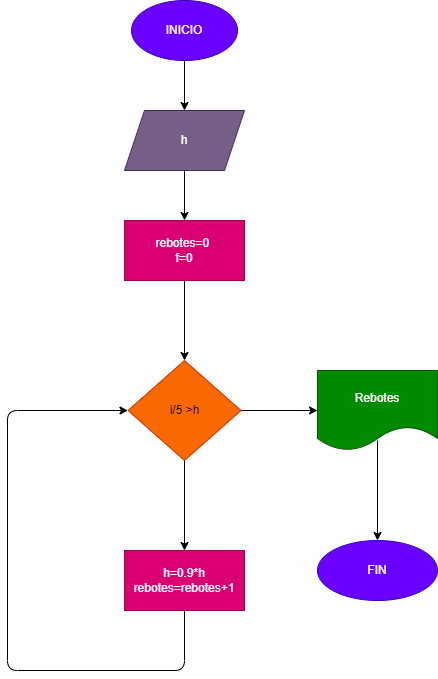

# rebote_pelota
Una pelota se deja caer desde una altura h, y en cada rebote sube el 10% menos del anterior.hacer el diagrama de flujo y el programa en python, que lea la h y que calcule e imprima en cual rebote la pelota no alcanza a subir la quinta parte de la altura inicial.

# Análisis:
Para resolver este problema debemos primero determinar cual es el 10% menos de esa altura y a su vez calcular cual es la quinta parte , luego mediante la logica matematica calcular cuantos rebotes hasta que eso sea verdadero 

